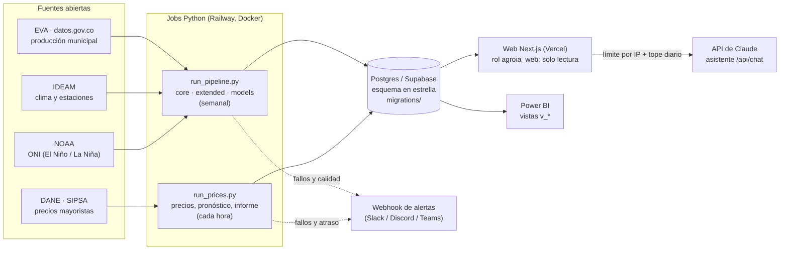

# Arquitectura de AgroIA

## Vista general



## Capas

| Capa | Dónde | Responsabilidad |
|---|---|---|
| Extracción | `extract/` | Descarga con reintentos; cada fuente deja un reporte de completitud. |
| Limpieza | `clean/` | Normaliza nombres, tipos y unidades. **Un dato faltante es `NaN`, nunca 0.** |
| Carga | `load/` | Upserts idempotentes; `load/migrate.py` versiona el esquema; `load/ingest_log.py` es la bitácora única. |
| Modelos | `models/` | Feature store, rendimiento (XGBoost sobre la desviación del promedio histórico), alertas, pronóstico de precios. |
| Validación | `validate/` | Reporte de calidad (se guarda en la BD) y pruebas estadísticas (Welch, Kruskal-Wallis, η²). |
| Web | `web/` | Next.js 14. `app/api/*` consulta la BD; los componentes muestran estados vacíos honestos. |

## Flujo de datos

1. **Semanal** (`run_pipeline.py --mode all`): producción → clima → ENSO → entrenamiento. Cada etapa se registra en `ingest_run`
   y sus reportes de extracción se publican en `extraction_report`.
2. **Cada hora** (`run_prices.py --mode hourly`): sondea el boletín diario del DANE; si hay dato nuevo lo carga, y si el servicio SOAP va
   atrasado hace una carga incremental. Después regenera el pronóstico y el informe solo si hay un día nuevo.
3. **Web**: cada tarjeta lee de la BD y muestra su fuente y fecha. Si la BD falla responde 503 (sin detalles internos) y la interfaz
   muestra un estado de error; nunca inventa cifras.

## Decisiones de diseño

- **Nada inventado.** Sin datos → estado vacío. Los datos de ejemplo solo existen en `scripts/seed_dev.py` y quedan rotulados.
- **Evaluación honesta.** El último año con datos se reserva como prueba; el modelo se compara con la línea base «promedio histórico» y solo se
  guardan predicciones fuera de muestra.
- **Migraciones versionadas e idempotentes**, aplicadas en una transacción con candado; RLS activado y un rol web de solo lectura.
- **Tolerancia a fallos de la bitácora.** Si `ingest_run` no se puede escribir, el trabajo real continúa.
- **El asistente está acotado:** límite por IP (hash con sal) y tope global diario, mensajes y historial con tamaño máximo, sin cifras de memoria.
- **URLs como estado.** La navegación y los filtros viven en el hash (`#precios?dep=…`): el botón «atrás» y los enlaces compartidos funcionan.

## Mapa de carpetas

```
config/      variables y constantes (validadas en settings.py)
extract/     descargas por fuente
clean/       normalización
load/        db, migraciones, cargas, bitácora
migrations/  001…004 versionadas + R__ repetibles (vistas, seguridad)
models/      features, entrenamiento, informes
validate/    calidad y estadística
utils/       reintentos HTTP, alertas por webhook
scripts/     seed_dev.py, gen_data_dictionary.py, tasks.ps1
tests/       pytest (las de marca `db` usan un Postgres desechable)
web/         aplicación Next.js + e2e (Playwright + axe)
docs/        esta documentación
```
